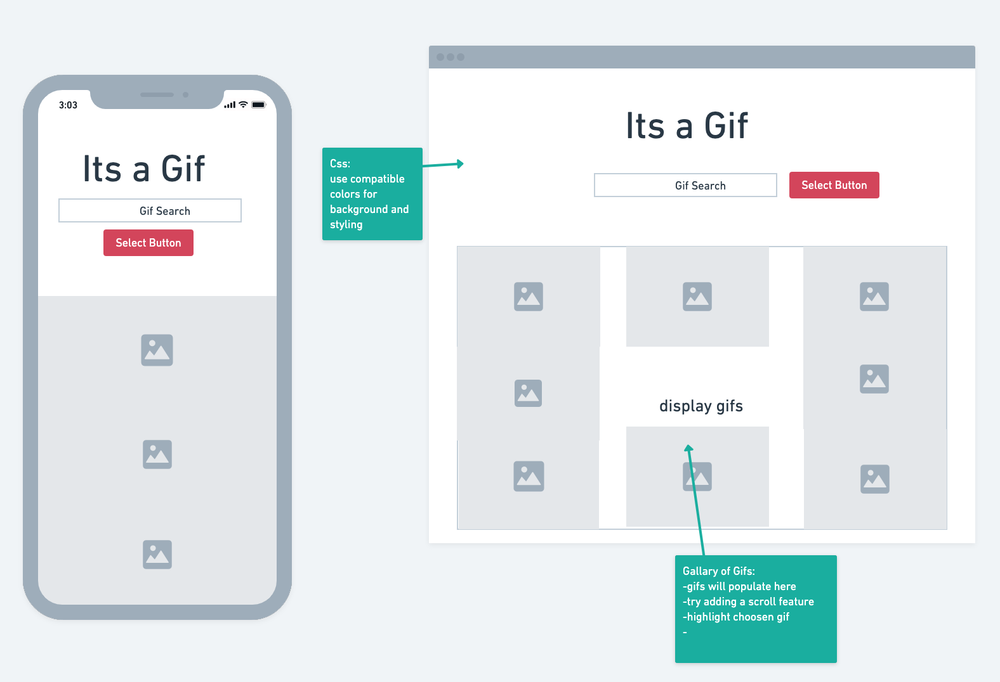

# It's a GIF

An application that allows you to quickly choose a gif or sticker based on a key search word.

### Technologies Used

- JavaScript
- HTML
- CSS
- JQuery
- Google Fonts
- Giphy API

### Wireframes

### Daily Plan

|Day|Goal|
|----|----|
| 1 | Choose API, wireframe |
| 2 | Render data to screen, basic html and css |
| 3 |  |

### Link to Project
[My Project Live Page](https://kayfernander2022.github.io/project1/)
https://kayfernander2022.github.io/project1/
https://project1-xi-one.vercel.app/

### Future Enhancements
